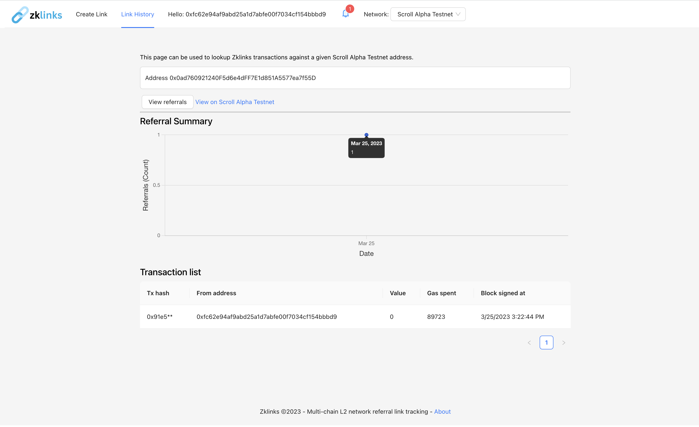

 

    

 

Zklinks: A multi-chain L2 network referral link tracking platform
---

Zklinks is a multi-chain Layer 2 (L2) link tracking platform that leverages zero-knowledge L2 networks to provide users with a more secure and private way to track click referrals and earn rewards. 

Built as a prototype for the Scaling Ethereum 2023 hackathon.

Live demo: https://zklinks.surge.sh (testnet)

Video: https://youtu.be/a9Oe-8Rp178

### Motivation

Unlike traditional referral programs, where personal information such as email addresses, phone numbers, or social media profiles may be shared, zklinks allows users to keep their personal data private while still being able to participate in referral programs and earn rewards.

When a user generates a referral link using zklinks, the link is hashed and encrypted using zero knowledge proofs. This means that the link can be used to track referrals and determine whether a user is eligible for a reward, without revealing any personal information about the user or their friend. The platform also allows users to view their referral statistics from the app, such as the number of clicks and successful referrals, while maintaining their privacy. 

Successful referrals are represented as permanent transactions against Zklink 'LinkContract' smart contracts rather than centralized databases. L2 networks also offer some of the lowest transaction fees and highest throughput such that click tracking can be done at scale.

## Technologies used

Zklinks is currently available on prominent L2 test networks. To create a new link, simply connect your metamask account to one of the below while on the app:

* Scroll: 
Scroll is a Layer 2 scaling solution for Ethereum that zklinks utilizes to provide users with an enhanced, more efficient click tracking experience. By using Scroll, we can take advantage of zk-rollups to batch transactions at lower cost, while still maintaining the security and trustlessness of the Ethereum network.

* Gnosis Chain: 
We are utilizing Gnosis Chain as a zkEVM-compatible base chain for zklinks. With Gnosis Chain, we can leverage the security and scalability benefits of Layer 2 networks, while still maintaining the ability to interact with smart contracts on the Ethereum mainnet/testnet.

* Polygon:
Polygon is another zkEVM-compatible base chain that we use for zklinks. By leveraging Polygon, we can provide users with fast, low-cost transactions and high throughput, while still maintaining the security and decentralization benefits of Layer 2 networks.

### Storage/Notifications

* Polybase: Acts as a decentralized web3 Firebase. Used for link dashboards for a given account. With Polybase, Zklinks doesn't need a hosted backed for owner accounts and instead add and pulls lists of active links for a given accounts from a 'Zklinks' collection based on the active account wallet address.
* Push protocol: The owner of a LinkContract receives a notification through push protocol when a link is clicked / referred successfully.

## Advantages over other link tracking apps

Enhanced Privacy: One of the main advantages of using a zero-knowledge proof system like zklinks is the enhanced privacy it provides. Unlike traditional referral link tracking systems, which often require users to share personal information such as their email address or social media accounts, zklinks allows users to prove their referral without revealing any personal information. This means that users can refer friends and family without having to worry about their privacy being compromised.

Improved Security: Another benefit of using a zero-knowledge proof system like zklinks is the improved security it provides. Traditional referral link tracking systems are often vulnerable to hacking and other security breaches, which can compromise the personal information of both users and their referrals. By using a zero-knowledge proof system, zklinks can ensure that all referral data is kept secure and cannot be accessed by unauthorized parties.

Fair Rewards: Zklinks can also help ensure that rewards are distributed fairly and transparently. Traditional referral link tracking systems often have complex reward structures that can be difficult for users to understand, and can sometimes be manipulated by unscrupulous actors. By using an open smart contract system like zklinks, users can be confident that their referrals will be tracked accurately and that rewards will be distributed fairly based on their referral activity.

### Core referral logic

This snippet shows the core refer function of Zklink's deployed 'LinkContract'.

The L2 smart contract enforces that an address can only be referred and rewarded once for a given LinkContract. An event is emitted that can be indexed by external platforms.

### How to run

1. Define the following env variables (either locally or in a created `.env` file). These are configured with test values on the demo site.

<pre>
    REACT_APP_POLYBASE_NAMESPACE= # Optional custom namespace for polybase deployment/backend.
    REACT_APP_COVALENT_KEY= # Covalent api key used to power history page.
    REACT_APP_PUSH_PK= # Optional push protocol wallet private key for connected Zklinks staging channel.
</pre>

2. `yarn; yarn start`
### Example zklinks (try these out!)

Connect to the appropriate network via metamask and visit the following links.

You'll be redirected to the set url (in this case google.com) with a tracking transaction record appending to the Zklink contract.

Gnosis (Chaido):
https://zklinks.surge.sh/link/0xb1F35230c645C12Bc3066dcdcd774E704983d208

Scroll (Alpha):
https://zklinks.surge.sh/link/0xAE985d249B125c7b2CCc000B1D6ea250e1204E41

### Screenshots

#### Home

#### Creating a new link contract

#### Connecting wallet / switching L2 networks

#### Creating a new link

#### Link created

#### Error screen appears if the referral already occurred or if there was a general error

#### Referral transaction

#### Successful referrals creates transactions on the L2 networks

#### Scroll L2 contract

#### Gnosis L2 contract

### Push notification occurs on successful referral

#### Notifications powered by Push Protocol

#### Referrals tracked

#### Polybase schema

#### Polybase saves created links attached to an address

#### About

<!-- ### Useful links
Event page: https://ethglobal.com/events/scaling2023
Sponsors: https://ethglobal.com/events/scaling2023/prizes -->

## Potential future work

1. Integration with more blockchain networks: Currently, zklinks is designed to work on some of the popular Layer 2 networks for Ethereum, but there are many other blockchain networks out there that could benefit from a similar platform. Future work could involve adapting the platform to work with other popular blockchain networks such as Bitcoin, Binance Smart Chain, or Polkadot.

2. Adding new features: As the platform evolves, there will be opportunities to add new features that enhance the user experience and make the platform more useful. For example, one possible feature could be the ability to customize referral links with personalized messages or images. Another potential feature could be the integration of social media sharing tools, which would make it easier for users to share their referral links with their followers.

3. Load testing: As the user base grows, the platform will need to be able to handle an increasing volume of traffic and data. Future work could involve improving the platform's scalability and performance to ensure that it can handle a large number of users and transactions without slowing down or becoming unreliable.

4. Building partnerships with businesses: Referral programs are a popular marketing tool for many businesses, and there may be opportunities to build partnerships with businesses that want to use zklinks to manage their referral programs. Future work could involve reaching out to businesses and exploring partnerships that could benefit both parties.

5. Developing a mobile app: While the web app is already accessible on mobile devices, developing a dedicated mobile app could make it more convenient for users to track their referrals on the go. A mobile app could also provide additional features such as push notifications to alert users of new referral activity or special promotions.

6. Add mainnet network selection and (potentially separate) deployments for each.

#### Revenue opportunities

* Reward commissions earned by users through referral programs. For example, zklinks could take a percentage of the rewards earned by users as their commission.
* Premium features or functionalities for a monthly or annual subscription fee. For instance, users could pay a fee to access advanced referral analytics or receive personalized support.
* Partnerships with businesses or brands to create sponsored referral programs. 

<!-- 

Demo flow:
Introduction (30 seconds): Introduce the problem of current referral link tracking apps being centralized and requiring users to reveal personal information. Introduce zklinks as a zero-knowledge alternative that protects users' privacy while still enabling them to participate in referral programs. Show existing apps like bit.ly

Creating a referral link (1 minute): Demonstrate how easy it is to create a referral link using zklinks. Show how users can enter the relevant information, such as the name of the company and the reward for successful referrals, and generate a unique link that they can share with their friends.

Clicking a referral link (1 minute): Demonstrate how the act of clicking a referral link can be turned into a Metamask blockchain request. Show how this protects the user's privacy by not revealing their identity or personal information to the company. Also, show how the user can earn the referral reward if their friend successfully completes the referral. Redirect to original location

Dashboard and analytics (30 seconds): Demonstrate the dashboard where users can track their referral link activity and analytics. Show how users can see how many clicks their link has received, how many referrals have been successful, and how much reward they have earned.

Conclusion (30 seconds): Summarize the benefits of zklinks, including protecting user privacy, enabling participation in referral programs, and providing analytics to track progress. Encourage users to try Stealthlink for themselves and share it with their friends.

Sponsors:

-->